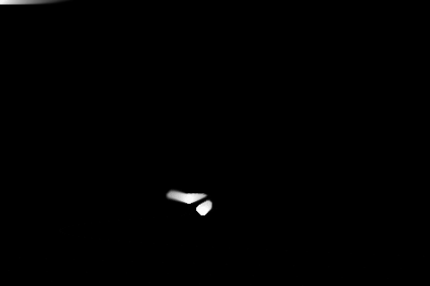
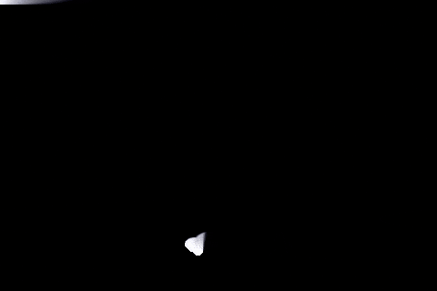

# Smoke Shader

A small smoke-like shader written in Love2D/Lua with GLSL.




## How to run

To run, download Lua and the love framework (LÖVE 11.4), then run love.exe in the current folder:

```
love .
```

Note: you may have to specify the full path to the love executable if it is not on your path.
